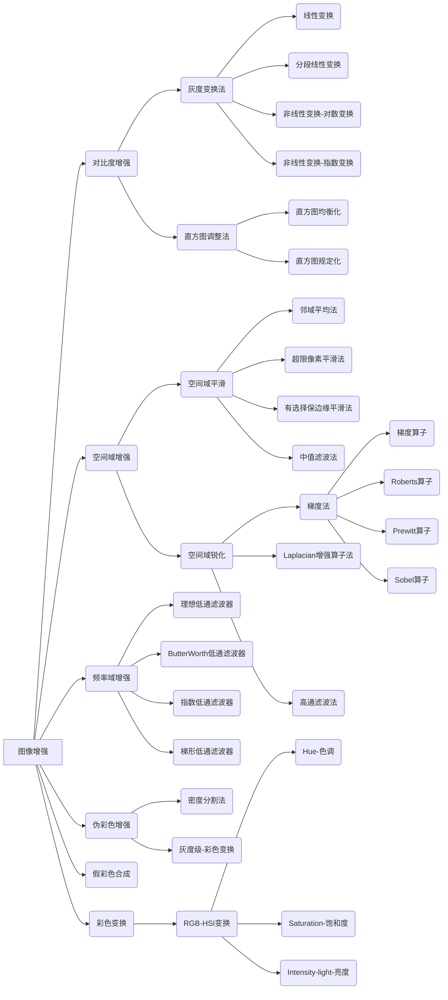

## 图像增强-对比度增强-灰度变换

+ 通过调整图像的灰度动态范围或调整图像的对比度进行图像增强；

+ 对比度，就是明暗的对比程度。

### 1.  线性变换

+ $f(i,j)\to g(i,j)$,$[a,b]\to [c,d]$
+ $g(i,j)=c+\frac{d-c}{b-a}(f(i,j)-a)$
+ 应用在图片曝光不足或过曝的情况，图像灰度可能局限在一个很小的范围，可以进行__线性拉伸__。

### 2.  分段线性变换

+ 如果只对图像中的部分目标感兴趣，这时候需要突出感兴趣目标所在的灰度区间，抑制不感兴趣的灰度区间，分段线性变换可以解决这类问题。

+ $f(i,j)\in\left[0,M_f\right]$,感兴趣的区间是$\left[a,b\right]$,要把感兴趣的区间拉伸到$\left[c,d\right]$,其中$a>c>0,b<d<M_f$.
  $$
  g(i,j)=
  \begin{cases}
  \begin{eqnarray}
  \frac{c-0}{a-0}f(i,j)&,&0\le f(i,j) \lt a\\
  \frac{d-c}{b-a}{\left[f(i,j)-a\right]}+c&,&a\le f(i,j)\lt b\\
  \frac{M_g-d}{M_f-b}{\left[f(i,j)-b\right]}+d&,&b\le f(i,j)\lt M_f
  \end{eqnarray}
  \end{cases}\\
  $$

+ 若$M_f==M_g$,可见在$[a,b]$之间的像素点拉伸到$[c,d]$,在$[0,a)$和$(b,M_f]$的像素点被压缩。

### 3.  非线性变换-对数变换

+ $f(i,j)\to g(i,j),[a,b]\to [c,d]$
+ $g(i,j)=a+\frac{ln\left[f(i,j)+1\right]}{b\ln c}$
+ 在低灰度区有较大的拉伸，在高灰度取压缩。

### 4.  非线性变换-指数变换

+ $f(i,j)\to g(i,j),[a,b]\to [c,d]$
+ $g(i,j)=b^{c\left[f(i,j)-a\right]}-1$
+ 在高灰度区有较大的拉伸

 

## 图像增强-对比度增强-直方图调整法

+ 图像的灰度直方图用来反应数字图像中每一灰度等级与这个灰度级出现频率之间的关系。

### 1.  直方图均衡化

+ 概念：将原图像通过某种变换，得到一幅灰度直方图均匀的新图像。
+ 连续变换图像的均衡化问题：
  + 假设$r$表示归一化的原图像灰度，$s$表示经过直方图修正后的图像灰度，$0\le r,s\le1$
  + 在任意一个$[0,1]$区间内的任意$r$,经过直方图均衡化都可以产生一个$s$z值，$s=T(r)$.
  + $T(r)$即变换函数，需要满足
    + 在$0\le r\le1$内为单调递增函数；
    + 在$0\le r\le 1$内有$0\le T(r)\le 1$;
  + 显然，逆变换$r=T^{-1}(s)$也满足上述条件。
  + 从概率论理论我们可以知道,如果已知随机变量$r$的概率密度$p_r(r)$，而随机变量$s$是$r$的函数，则从$s$的概率密度$p_s(s)$可以由$p_r(r)$求出。
  + 假设随机变量$s$的分布函数用$F_s(s)$表示，根据分布函数的定义，有
    + $F_s(s)=\int_{-\infty}^{s}{p_s(s)ds}=\int_{-\infty}^{r}{p_r(r)dr}$
    + 又因为密度函数是分布函数的导数，两边同时对$s$求导，可以得到
    + $P_s(s)=\frac{d}{ds}\left[\int_{-\infty}^{r}p_r(r)dr\right]=p_r\frac{dr}{ds}=p_r\frac{d}{ds}\left[T^{-1}(s)\right]$
    + 上式是直方图修正技术的基础，我们可以通过变换函数$T(r)$控制原图像灰度级的概率密度函数，得到输出图像的概率密度函数，因此可以改善原图像的灰度层次。
    + 一副图像的直方图如果是均匀分布的，即$P_s(s)=k=1$,该图像色调给人的感觉会比较协调。
  + 如何求$T(r)$
    + 根据归一化假定：$P_s(s)=1$
    + 所以$1=p_r\frac{dr}{ds}$,即$ds=p_rdr$
    + 两边积分可以得到
    + $s=T(r)=\int_{0}^{r}{p_r(r)dr}$
    + 所以$T(r)$就是$r$的累积直方图函数。
+ 根据连续直方图均衡化的相关结论，用频率代替概率，变换函数$T(r_k)$的离散形式可表示为
  + $s_k=T(r_k)=\sum_{j=0}^{k}{p_r(r_j)}=\sum_{0}^{k}{\frac{n_j}{n}}$
  + 这表明，均衡化后各像素的灰度值$s_k$可直接由原图像的直方图算出来。