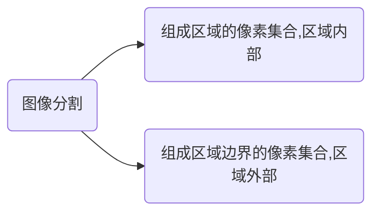

# 8.1  二值图像的连接性和距离

+ 二值图像处理的基本流程

  ```mermaid
  graph TD
  A(浓淡图像)-->B(二值化)
  B-->C(连接成分的变形)
  C-->D(图像特征测量)
  D-->E(分类 测量)
  C-->F(结构分析描述)
  F-->G(识别理解)
  D-->G
  
  ```

+ 二值图像的几何概念
  + 邻域和邻接
    + 对于任意像素$(i,j)$,把像素的集合${(i+p,j+q)}$($p,q$是一对适当的整数)叫做$(i,j)$的邻域.
    + 直观上看，邻域就是$(i,j)$附近的像素形成的区域.
    + 最经常采用的是$4$邻域(上下左右)和$8$邻域(上下左右,对角线).
  
  + 像素的连接
  
+ 对于二值图像中，若具有相同值的两个像素$A$和$B$,所有和$A$、$B$具有相同值的像素系列$p_0(=A),p_1,p_2,...,p_{n-1},p_n(=B)$存在且$p_{i-1}$和$p_i$互为$4/8$邻接,那么像素$A$和$B$叫做$4/8$连接,以上的像素序列叫做$4/8$__路径__.
  
  + 连接成分
    + 在二值图像中，把互相连接的像素的集合汇集为一组，于是具有若干个0值的像素($0$像素)和具有若干个1值的像素($1$像素)的组就产生了.
    + 这些组就是连接成分或连通成分.
    + __连接性矛盾示意图__
    + 如果把$1$像素看成8连接，那么$0$像素就必须用$4$连接.
    + 如果把$1$像素看成4连接，那么$0$像素就必须用8连接.
    + 没有孔的连接成分称为:__单重连接成分__.
    + 具有孔的连接成分称为:__多重连接成分__.
  
  + 欧拉数:
    + 在二值图像中,$1$像素连接乘分数$C$减去孔数$H$就叫做这幅图像的欧拉数或__示性树__.
    $$
    E = C-H
    $$
    + 对于一个$1$像素连接成分，$1$减去这个连接成分中所包含的孔数的插值就叫做这个$1$像素连接成分的欧拉数.
    + 二值图像的欧拉数是所有$1$像素连接成分的__欧拉数之和__.
  
  + 像素的可删除性和连接数
    + 如果二值图像上的某个像素的值改变后,整个图像的连接性并不改变(各连接成分既不分离、不结合，孔也不产生、不消失),那么这个像素就是可删除的.
    + 如果判断一个像素是否可删除?一般用像素的连接数来检测.
    + 连接数：二值图像中某点$p$的像素值$B(p)=1$,则像素$p$的连接数$N_c(p)$为与$p$连接的连接成分数.
    + 计算像素$p$的$4/8$邻接的连接数公式(todo,怎么算的啊，FUCK):
    $$
    N_c^4(p) = \sum_{k\in S}{[ B(p_k)-B(p_k)B(p_{k+1})B(p_{k+2}) ]}\\
    N_c^8(p) = \sum_{k\in S}[\overline{B}(p_k)-\overline{B}(p_k)\overline{B}(p_{k+1})\overline{B}(p_{k+2})]
    $$
    + 对于同一图像的像素,在$4$或$8$邻接的情况下,该像素的连接数不一定相同.
    + 像素的连接数作为__二值图像局部的特征量__是很有用的.
    + 像素按连接数$N_c(p)$的大小分类
      + 孤立点:对于$1$像素点$p$,在$4/8$邻接的情况下,当其$4/8$邻接的像素全是$0$时,像素$p$为孤立点.其连接数$N_c(p)=0$
      + 内部点:对于$1$像素点$p$,在$4/8$邻接的情况,当其$4/8$邻接的像素全是$1$时,称为内部点,内部点的连接数$N_c(p)=0$
      + 边界点:在$1$像素中, 除开孤立点和背景点$1 \le N_c(p)\le 4$.
        + 删除点或端点:$N_c(p)=1$;
        + 连接点:$N_c(p)=2$
        + 分支点:$N_c(p)=3$
        + 交叉点:$N_c(p)=4$
      + 背景点:吧所有像素值$B(p)=0$的像素叫做背景点.

  + 距离
    + 对于集合$S$中的两个元素$p$和$q$,当函数$D(p,q)$满足下式时,就把$D(p,q)$叫做$p$和$q$的距离，也称为距离函数.
    $$
    \begin{cases}
    D(p,q)\gt 0 \\
    D(p,q)=D(q,p)\\
    D(p,r)\le D(p,q) + D(q,r)
    \end{cases}
    $$
    + 常用计算方法:
      + 欧几里得距离
      $$
      d_e[(i,j),(h,k)] = ((i-h)^2 + (j-k)^2)^{\frac{1}{2}}
      $$
      + 4-邻域距离(街区距离)
      $$
      d_4[(i,j),(h,k)] = |i-h| + |j-k|
      $$
      + 8-邻域距离(棋盘距离)
      $$
      d_8[(i,j),(h,k)] = \max\{|i-h|,|j-k|\}
      $$
      + 八角形距离(结合$d_4$和$d_8$)
        + 等距线为八角形.
        + 公式(todo).
      + $d_8 \le d_4 \le d_e$


+ 二值图像连接成分的各种变形算法

+ 二值图像特征提取与描述的各种方法


# 8.2 连接成分的变形操作

+ 连接成分的标记
  
+ 为了区分二值图像中的连接成分,求得连接成分的个数,__对属于同一个$1$像素连接成分的所有像素分配相同的编号__,不同的连接成分分配不同的编号的操作.
  
+ 膨胀
  + 把连接成分的边界扩大一层的处理.
  $$
  g(i,j) = 
  \begin{cases}
  1,there\ is \ one\ '1'\ at \ last \in \ S_4\ or\ S_8 \\
  0,other
  \end{cases}
  $$
+ 收缩
  + 把连接成分的边界点去掉而缩小一层的处理.
  $$
  g(i,j) = 
  \begin{cases}
  0,there\ is \ one\ '0'\ at \ last \in \ S_4\ or\ S_8 \\
  1,other
  \end{cases}
  $$

+ 膨胀和收缩的反复使用就可检测或清除二值图像中的__小成分__或__空__.
+ 先膨胀后收缩:填平小沟,弥合空洞和裂缝.
+ 先收缩后膨胀:去掉图中的孤立点的毛刺.

+ 线图形化  
  + 距离变换和骨架化处理
    + 把__任意图形__转换成__线划图__的最有效方法之一.是求二值图像中各$1$像素到$0$像素的__最短距离__的一种处理.
    + 在经过距离变换得到的图像中，最大值点的集合就形成$1$像素区域的骨架.
    + 骨架反映了__原图形的形状__,给定距离和骨架就能恢复该图形，但恢复的图形不能保证原始图像的连接性。
    + 距离变换和骨架化处理常用于图像压缩、提取图形幅度和形状特征等.
  
  + 细化
    + 从二值图像中提取线宽为1的$1$像素的中心线的操作.
    + 从处理方法上分为__顺序处理__和__并行处理__,从连接性上分为__8-邻接细化__和__4-邻接细化__.
    + 介绍一种8-邻接细化中有代表性的一种方法-__希尔迪奇(Hilditch)__方法.
      + 设像素$(i,j)$记为$p_0$,其8-邻域的像素用$p_k$表示
      $$
      \left[
      \begin{matrix}
      p_4 & p_3 & p_2 \\
      p_5 & p_0 & p_1 \\
      p_6 & p_7 & p_8
      \end{matrix}
      \right]
      $$
      + 按__光栅扫描顺序__研究二值图像的像素$p_0$,当$p_0$完全满足以下六个条件时,把$p_0$的值$B(p_0)$置换成$-1$,注意,条件2、3和5是在并行处理方式中所用的各像素的值,条件4、6是在顺序方式中所有的各像素的值.
      + 对已置换成$-1$的像素,在不用当前处理结果的并行处理方式中，把该像素的值复原到1，而在用当前处理的结果的顺序处理方式中，仍为-1.
      + 6个条件
        + 1. $p_0$的值必须等于1.
        + 2. $p_0$是边界像素的条件,即$\sum$
        + 这是在上你妈逼的课.

+ 边界跟踪
  + 为了求得区域间的连接关系，必须沿区域的边界点跟踪像素，这个过程称之为边界跟踪或边缘跟踪.
  + 具体方法和步骤
    + 1. 根据光栅扫描发现像素从$0$开始变为$1$的像素$p_0$时,$p_0$作为边界的起点,存储他的坐标$(i,j)$值.
    + 2. 从像素$(i,j-1)$开始逆时针方向在像素$(i,j)$的8-邻域寻找$1$像素,当第一次出现$1$像素记为$p_k$,存储$p_k$的坐标.
    + 3. 逆时针方向从$p_{k-1}$以前的像素开始在$p_k$像素的8-邻域内寻找1像素，把最先发现像素值为1的像素记为$p_{k+1}$.
    + 4. 当$p_k=p_0$而且$p_{k+1}=p_1$时，跟踪结束，在其他情况下，把$k+1$重新当做$k$返回第$3$步,反复进行处理.

    
    $S_1$和$S_2$表示光栅扫描,$S_3$表示以$p_0$为中心逆时针扫描，$S_4$表示$p_1$为中心逆时针扫描,$S_5$表示以$p_2$为中心逆时针扫描,$S_6$表示以$p_3$为中心逆时针扫描.
  + 二值图像的边界跟踪是在图像边缘连接明确的假设下进行的，但实际上很多图像的边缘连接并不是明显的.这时可以使用__浓淡图像直接跟踪边缘__,但必须同时进行边缘检出(根据图像斜率的大小和方向跟踪边缘的像素).


# 8.3 形状特征提取(区域内部形状提取与分析)
+ 对图像中的具体目标提取形状特征,进而对图像进行识别和理解.



+ 提取方法
  + 区域内部形状特征提取
    + 空间域分析:直接在图像的空间域对区域内部提取形状特征，以便于分析.
      + 拓扑描述子:欧拉数,对区域的全局描述很有用.
      + 凹凸性:
        + 连接图形内任意两个像素的线段，如果不通过这个图像意外的像素，则这个图像就是凸的.
        + 包含一个图形的最小的凸图形称为这个图形的凸闭包，凸图形的凸闭包就是他本身.
        + 从凸闭包出去原始图形后，所产生的图像的位置和形状是形态特征分析的重要线索.
      + 区域的测量
        + 面积:区域的面积就是区域内像素点个数的总和
        + 周长
          + 第一种方法:在区域的边界像素中，设某像素与其上下左右像素间的距离为$1$，与斜方向像素间的距离为$\sqrt{2}$,周长就是这些像素间距离的总和.
          + 第二种方法:将边界的像素总和作为周长.
        + 圆形度:
        $$
        R=4\pi\frac{面积}{(周长)^2}
        $$
        如果区域为圆形,这时$R=1$,取得最大,如果区域为一个细长的区域,则$R$较小
        
        + 常用的特征量还有区域的直径、幅宽和占有率等.
    + 区域内部变换法:
      + 是形状分析的经典方法，包括求区域的各阶统计矩、投影和截口等.
      + 矩法:函数$f(x,y)$的$p+q$阶矩定义式为:
      $$
      m_{pq}=\int_{-\infty}^{+\infty}\int_{-\infty}^{+\infty}x^py^qf(x,y)dxdy \ \ \  p,q\in N_0 = \{0,1,2,... \}
      $$
      则大小为$n\times m$的数字图像$f(i,j)$的矩为:
      $$
      m_{pq}=\sum_{i=1}^{n}\sum_{j=1}^{m}i^pj^qf(i,j)
      $$
      0阶矩$m_{00}$是图像灰度的总和,二值图像的$m_{00}$表示__对象物的面积__.
      如果有$m_{00}$来归一化1阶原点矩阵$m_{10}$及$m_{01}$,则可以得到中心坐标$(i_G,j_G)$.
      $$
      i_G = \frac{m_{10}}{m_{00}},j_G = \frac{m_{01}}{m_{00}}
      $$
      目标形心:是一个关键性的位置参数,它的精确与否直接影响到目标定位，可以用矩方法来确定.
      定义中心距为:
      $$
      M_{pq} = \sum_{i=1}^{n}\sum_{j=1}^{m} (i-i_G)^p(j-j_G)^qf(i,j)
      $$
      中心距能反映灰度相对于灰度中心是如何分布的.
      利用中心矩可以提取一些区域的一些基本形状特征:延伸方向，对称轴.
      艹你妈的7个不变矩.

      计算量较大,很少用.
      + 投影和截口...艹尼玛.
      +  
  + 区域外部形状特征提取
    
    + ???
  + 利用图像层次型数据结构，提取形状特征(略).

