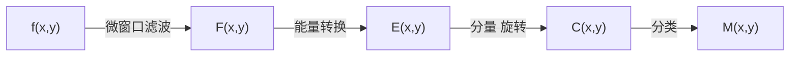

# 9.1 纹理分析概述

+ 图像纹理指图像像素的一种排列规则.
  
  + 最初指纤维物的外观
  
  + 字典中的定义:由紧密的交织在一起的单元组成的某种结构.
  
  + 纹理:局部不规则,宏观有规律.
  
+ 纹理分析的原理
  
  + 木纹、花纹都反映了物体表面颜色与灰度的某种变化，这些变化与事务本身的属性有关. 
  
  + 纹理分析:通过一定的图像处理技术提取出__纹理特征参数__,从而获得纹理的定量或定性描述的处理过程.
  
  + 纹理分析的关键:
    
    + __特征提取__:是纹理分析的基础, 用于__纹理识别__、__纹理分类__和__三维表面重建__.
  
+ 纹理分析的方法

  + 统计分析法、结构分析法、频谱分析法和模型分析法.
  
  + __统计分析法__
    
    + 主要基于图像像素的__灰度值__的分布与相互关系，找出反映这些关系的特征.
    
    + 基本原理:选择不同的统计量对纹理图像的统计特征进行提取.
    
    + 最常用的方法:__共生矩阵法__和__长行程法__.
    
    + 其中共生矩阵又包括__灰度共生矩阵(GLCM)__和__灰度-梯度共生矩阵__.
    
  + __结构分析法__
  
    + 是分析图像纹理的结构,从中获取结构特征.
    
    + 结构分析法
      
      + 将纹理看成许多__纹理基元__按照一定位置的规则组成,
      
      + 1.提取纹理基元
      
      + 2.推论纹理基元位置规律
      
    + 适用于规则和周期性的纹理，实际中用得比较少.
      
  
  + __频谱分析法__
  
    + 基于__滤波器理论__,包含了傅里叶变换法、Gabor(加伯)变换法和小波变换法.
    
    + __傅里叶变换法__:只能完成图像的频率分解,因而获得的信息不是很充分.
    
    + __Gabor变换法__: Gabor函数可以捕捉到相当多的纹理信息，且具有极佳的空间/频域联合分辨率,因此应用广泛.
    
    + __小波变换法__: 大体上分金字塔形小波变换法和树形小波变换法.
  
  + __模型分析法__
  
    + 自回归模型、马尔科夫随机场模型、Gibbs随机场模型和分型模型等.
    
    + 这些方法都是用__模型系数来表征纹理图像__.
    
    + 关键在于首先要对纹理图像的结构进行分析以__选择到最合适的模型__,其次为如何__估计这些模型关系__.
    
    + 这类方法存在着__计算量大__，__自然纹理__很难用单一模型表达的缺点.
    
    + __Gibbs随机场模型(GFR)__
    
      + GFR模型通过__集团势能__的概念，利用局部计算就能获得全局的结果，因此该模型目前应用较多.
      
    + __分形模型__
      
      + 分形是一种适合于描述具有复杂和不规则形状研究对象的数学模型.
    
      
      
      
      
# 9.2 Laws纹理能量测量法

+ ???为什么是第4种统计分析方法.

+ 方法概述

  + __一阶__分析方法
  
  + 分析方法简单、有效.
  
  + 所提供的模板较少，应用受到一定的限制.
  
+ 原理

  + 基本思想是设置两个窗口
    
    + __微窗口__: 可为$3\times 3$,$5\times 5$或$7 \times 7$,常取$5\times 5$用来测量以像素为中心的小区域的灰度的不规则性，以形成属性，称为__微窗口滤波__.
    
    + __宏窗口__: 为$15\times 15$或$32\times 32$,用来在更大的窗口上求属性的__一阶统计量__(常为均值和标准偏差，称为__能量变换__)，再进行纹理特征提取分析.
  
+ 分析流程

微窗口滤波: 检测度量纹理结构信息
能量转换: 纹理信息
分量旋转:纹理能量信息检测
分类:纹理分析

  

  