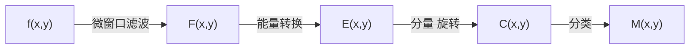

# 9.1 纹理分析概述

+ 图像纹理指图像像素的一种排列规则.
  
  + 最初指纤维物的外观
  
  + 字典中的定义:由紧密的交织在一起的单元组成的某种结构.
  
  + 纹理:局部不规则,宏观有规律.
  
+ 纹理分析的原理
  
  + 木纹、花纹都反映了物体表面颜色与灰度的某种变化，这些变化与事务本身的属性有关. 
  
  + 纹理分析:通过一定的图像处理技术提取出__纹理特征参数__,从而获得纹理的定量或定性描述的处理过程.
  
  + 纹理分析的关键:
    
    + __特征提取__:是纹理分析的基础, 用于__纹理识别__、__纹理分类__和__三维表面重建__.
  
+ 纹理分析的方法

  + 统计分析法、结构分析法、频谱分析法和模型分析法.
  
  + __统计分析法__
    
    + 主要基于图像像素的__灰度值__的分布与相互关系，找出反映这些关系的特征.
    
    + 基本原理:选择不同的统计量对纹理图像的统计特征进行提取.
    
    + 最常用的方法:__共生矩阵法__和__长行程法__.
    
    + 其中共生矩阵又包括__灰度共生矩阵(GLCM)__和__灰度-梯度共生矩阵__.
    
  + __结构分析法__
  
    + 是分析图像纹理的结构,从中获取结构特征.
    
    + 结构分析法
      
      + 将纹理看成许多__纹理基元__按照一定位置的规则组成,
      
      + 1.提取纹理基元
      
      + 2.推论纹理基元位置规律
      
    + 适用于规则和周期性的纹理，实际中用得比较少.
      
  
  + __频谱分析法__
  
    + 基于__滤波器理论__,包含了傅里叶变换法、Gabor(加伯)变换法和小波变换法.
    
    + __傅里叶变换法__:只能完成图像的频率分解,因而获得的信息不是很充分.
    
    + __Gabor变换法__: Gabor函数可以捕捉到相当多的纹理信息，且具有极佳的空间/频域联合分辨率,因此应用广泛.
    
    + __小波变换法__: 大体上分金字塔形小波变换法和树形小波变换法.
  
  + __模型分析法__
  
    + 自回归模型、马尔科夫随机场模型、Gibbs随机场模型和分型模型等.
    
    + 这些方法都是用__模型系数来表征纹理图像__.
    
    + 关键在于首先要对纹理图像的结构进行分析以__选择到最合适的模型__,其次为如何__估计这些模型关系__.
    
    + 这类方法存在着__计算量大__，__自然纹理__很难用单一模型表达的缺点.
    
    + __Gibbs随机场模型(GFR)__
    
      + GFR模型通过__集团势能__的概念，利用局部计算就能获得全局的结果，因此该模型目前应用较多.
      
    + __分形模型__
      
      + 分形是一种适合于描述具有复杂和不规则形状研究对象的数学模型.
    
      
# 9.2 纹理分析的频谱分析方法

+ 傅里叶频谱分析方法
  
  + 纹理特征__二次__统计量(典型的特征)
  $$
  F(u,v) = \int{\int{f(x,y)e^{-j2\pi(ux+vy)}}}dxdy
  $$
  功率谱
  $$
  |F(u,v)|^2 = F^{*}(u,v)F(u,v)
  $$
  
  + __功率谱__的径向分布与图像$f(x,y)$空间域中的纹理的粗细程度有关，对于稠密的细纹理，功率谱沿径向分布比较分散，对于稀疏的粗纹理，功率谱往往比较集中于原点附近；对于有方向性的纹理，功率谱的分布将偏置于与纹理垂直的方向上.
  
  + 频谱法借助于傅里叶频谱的频率特性来描述__周期__的或__近乎周期__的二维图像模式的方向性，常用的三个性质是:
    
    + 傅里叶频谱中__突起的峰值__对应__纹理模式的主方向__;
  
    + 这些峰在频域平面的位置对应模式的基本周期; 

    + 如果利用滤波把周期性成分除去，剩下的非周期性部分可用统计方法描述.S_r(\thetas)

  + 实际检测中，为简便起见可把频谱转化到极坐标中，此时频谱可以用$S(r,\theta )$表示，对每一个确定的方向$\theta $,$S(r,\theta) $是一个一维函数$S_{\theta}(r)$;对每个确定的频率$r$,$S(r,\theta)$是一个一维函数$S_r(\theta )$.

  + 对于给定的$\theta $,分析$S_{\theta}(r )$得到的频谱在沿原点射出方向的行为特性;对给定的$r$,分析$S_r(\theta )$得到频谱在以原点为中心的圆上的行为特性。

  + 若把这些函数对下表求和可得到更为全局性的描述:
  $$
  S(r)=\sum_{\theta = 0}^{\pi}S_{\theta}(r)\\
  S(\theta)=\sum_{r=1}^{R}S_{r}(\theta)
  $$
  $R$是以原点为中心的圆的半径.

  + $S(r)$和$S(\theta)$构成整个图像或图像区域频谱能量的描述.

  ​    
# 9.3 Laws纹理能量测量法

+ ???为什么是第4种统计分析方法.

+ 方法概述

  + __一阶__分析方法
  
  + 分析方法简单、有效.
  
  + 所提供的模板较少，应用受到一定的限制.
  
+ 原理

  + 基本思想是设置两个窗口
    
    + __微窗口__: 可为$3\times 3$,$5\times 5$或$7 \times 7$,常取$5\times 5$用来测量以像素为中心的小区域的灰度的不规则性，以形成属性，称为__微窗口滤波__.
    
    + __宏窗口__: 为$15\times 15$或$32\times 32$,用来在更大的窗口上求属性的__一阶统计量__(常为均值和标准偏差，称为__能量变换__)，再进行纹理特征提取分析.
  
+ 分析流程

微窗口滤波: 检测度量纹理结构信息
能量转换: 纹理信息
分量旋转:纹理能量信息检测
分类:纹理分析

# 9.4 纹理分析的自相关函数法

+ 模型分析方法

  + 纹理模型分析法
  
    + 基本原理:__一个像素与其邻域像素存在着某种相互关系__，这种关系既可以是线性的，也可以是服从条件概率的.

  + 常用模型:__自相关模型__、__自相关模型__、__Markov随机场模型__ 和 __分形模型__ 等.

+ 自相关模型(Self-correlation Model)

  + 自相关函数
  图像纹理的一个重要性质是纹理的反复性,图像的自相关函数的定义为
  $$
  \rho = \frac{\sum_{i=0}^{N-1}\sum_{j=0}^{N-1}f(x_i,y_i)f(x_i+x,y_j+y)}{\sum_{i=0}^{N-1}\sum_{j=0}^{N-1}f^2(x_i,y_j)}
  $$

  + 纹理度量
    
    + 利用图像纹理的自相关函数$\rho(x,y)$随$x,y$大小变化的规律，可以描述图像纹理的粗糙度、规整度和粗略度等特征.
    
    + 令$d=\sqrt{x^2+y^2}$,若图像的纹理较__粗__,则$\rho(x,y)$随着$d$增加而下降的速度较慢;

    + 若图像的纹理较__细__,则$\rho(x,y)$随$d$增加而下降的速度较快;

    + $\rho(x,y)$会呈现某种周期性变化，其周期的大小能够反映出局部模式排列规则的稀疏、稠密程度.

# 9.5 灰度共生矩阵法

+ 灰度共生矩阵又被称为:__灰度空间相关矩阵__，是通过研究 __灰度的空间相关特性__ 来描述纹理的常用方法.

+ 也被称为 __联合概率矩阵__.

+ 应用场景:利用图像纹理特征值所表征的图像空间结构信息来 __改善遥感图像的地学目标分类效果__.

+ 灰度共生矩阵$p(i,j|d,\theta )$定义为 从灰度为$i$的点离开某个固定的位置(相距$d$,方向为$\theta $)的点上灰度为$j$的概率

  + $d$的选择:适当选取

  + $\theta $的选择:取$0$度、$45$度,$90$度,$135$度.

+ 求灰度共生矩阵
  + 设$f(x,y)$为一幅__二维数字图像__,其大小为$M\times N$,灰度级别为$N_g$,则满足一定空间关系的灰度共生矩阵为:
  $$
  P(i,j) = \#\left\{ (x_1,y_1),(x_2,y_2)\in M\times N | f(x_1,y_1)=i,f(x_2,y_2)=j \right\}
  $$

+ 其中$\#(x)$表示集合$x$中的元素个数，显然$P$为$N_g \times N_g$的矩阵,若$(x_1,y_1)$与$(x_2,y_2)$间距离为$d$,两者与坐标横轴的夹角为$\theta$,则可以得到各种间距及角度的灰度共生矩阵$P(i,j,d,\theta )$

+ todo? 如何求.

+ 特点:
  
  + $d,\theta $取不同的数值组合，可以得到不同情况下的灰度共生矩阵. 
+ 当$d$取值较小时,对应于变换缓慢的纹理图像(较细的纹理),其灰度共生矩阵对角线上数值较大.
  
  + 纹理的变化越快，则对角线上的数值越小，而对角线两侧上的元素值增大.
+ 一幅图像的灰度共生矩阵反映了图像灰度关于方向、相邻间隔、变化幅度的综合信息，是分析__图像的局部特征和排列规律__的基础。
  + 灰度共生矩阵并不能直接提供纹理信息，为了能描述纹理的状况，需要在灰度共生矩阵的基础上再提取能综合表现灰度共生矩阵状况的纹理特征量，称为__二次统计量__.
  + 特征统计量(Haralick):__熵(Entropy)__、__对比度(Contrast)__、__能量(Energy)__、__相关(Correlation)__、__方差(Variance)__等.
  
+ 优化灰度共生矩阵

  + 必要性:如果一幅图像的灰度级数比较高(如256级)，这样级数太多会导致计算得到的灰度矩阵特别大，计算量大。
  + 解决方法：灰度级压缩($256\to 16$)
  + 在提取特征之前，需要对灰度共生矩阵作__正规化处理__.
    + 令$P(i,j)=\frac{p(i,j)}{R}$,$R$正规化常数.
    + 当$d=1,\phi=0^{\circ}$时，每一行有$2(N_x-1)$个水平相邻像素对，因此共有$2N_y(N_x-1)$水平相邻像素对，这时$R=2N_y(N_x-1)$
    + 当$d=1,\phi=45^{\circ}$时，共有$2(N_y-1)(N_x-1)$相邻像素对，$R=2(N_y-1)(N_x-1)$
    + $\phi = 90^{\circ},135^{\circ}$ ,todo....?

+ 纹理特征的二次统计量

  + __角二阶矩(能量)__:是图像灰度分布__均匀性__的度量.
    $$
    ASM=E(d,\theta)=\sum_{i}\sum_{j}\left[p(i,j|d,\theta)\right]^2
    $$
    
    + 纹理粗时,$E$比较大,纹理细时$E$值小.
    
    + 当灰度共生矩阵元素分布较集中于主对角线附近时，说明局部区域内灰度分布较均匀，图像呈现较粗的纹理，角二阶矩的取值相应较大.
    
  + __惯性矩(对比度)__:表征图像中局部灰度变化的总量，图像的对比度可以理解为图像的清晰度，在图像中，纹理的沟纹越深，其对比度$I$越大，图像越清晰.
    $$
    CON=I(d,\theta)=\sum_{k}k^2\left[\sum_{i}\sum_{j}p(i,j|d,\theta) \right],k=i-j
    $$
    
    + 纹理深时$I$值大,纹理钱时$I$值小.
    
  + __相关性__
    
    + 纹理粗时$C$值大,纹理细$C$值小.
    
  + __熵__:(度量图像所有具有的信息量)
    
    + 图像没有任何纹理,则熵值几乎为零,若细纹理多,则熵值越大.
    
  + __局部均匀性(逆差矩)__:反映图像纹理的同质性,度量图像纹理局部变化的多少.
  
    + 其值越大，说明图像纹理的不同区域间缺少变化，局部非常均匀.
    
    + 当共生矩阵沿对角线集中时,其逆差距值较大.
    

+ 总结:
  
  + 由共生矩阵抽取的纹理特征度量是属于整个图像区域的,常用于分析和分类整个区域或整幅图像.
  
  + 每个方向的灰度共生矩阵,都可以计算以上几个特征量,对于四个方向的灰度共生矩阵,每个特征都有四个不同方向的值,常常取其平均值来作为方向无关的特征量.
  
  + 每一个统计属性都可以生成一个__纹理图像__或__波段__与__光谱特征__一起应用于分类,这些统计表征的优点是
     
     + 既能反应分类类别空间特征的显著差异
     
     + 又能与基于概率模型传统分类算法兼容.
     
  + 根据不用的图像和所需要提取的地物信息选择不同的统计属性作为指标,最终达到提取地物信息的目的.
     

